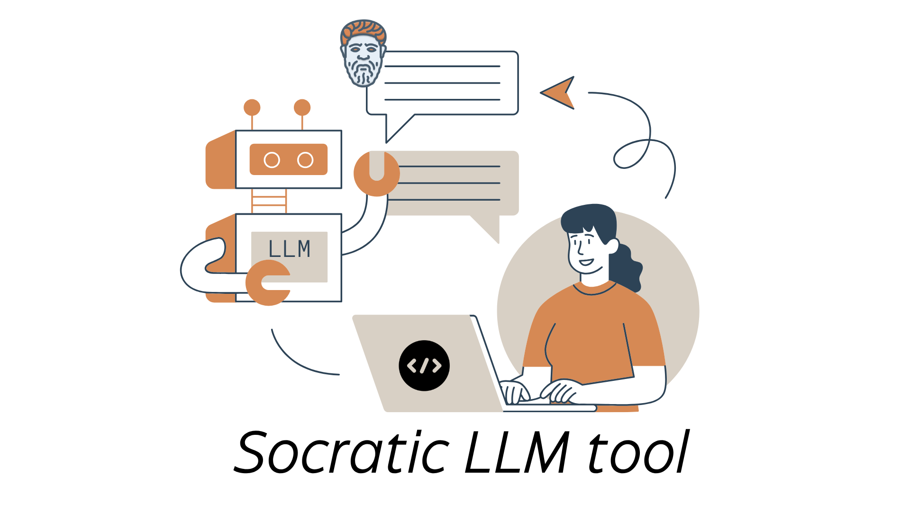
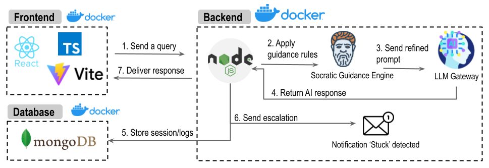

<p align="center"> 
   
</p>


<p align="center">

<a href="https://github.com/Ranith1/LLM-Junior-Developer/stargazers" target="blank">

</a>
<a href="https://github.com/Ranith1/LLM-Junior-Developer/issues" target="blank">

</a>
<a href="https://github.com/Ranith1/LLM-Junior-Developer/pulls" target="blank">

</a>

</p>

**Socrate LLM tool** is an LLM assistant that embeds a Socratic framework at the system-prompt level, enforcing one-question-at-a-time dialogue, reflective checkpoints, and graduated hints, to promote learning during code generation, explanation, and debugging.

- [Socratic Framework](#socratic-framework)
- [Software Architecture](#software-architecture)
- [Requirement](#requirements)
- [How to Run](#how-to-run)
- [Use Cases](#use-cases)
- [Project Team](#project-team)

## Socratic Framework

The Socratic method (Liu et al., 2024) is central, using inquiry to promote critical thinking and self-directed learning. The method starts with context-based questions that guide learners toward independent reasoning about programming concepts instead of offering direct solutions. The approach uses a step-by-step Socratic questioning sequence, starting with broad exploratory prompts (e.g., “What do you expect this function to do?”) and moving to targeted diagnostic questions (e.g., “Why do you think this line causes an error?”). Based on the learner’s responses, the tool adapts—refining its next questions or hints—to progressively guide users to discover solutions independently. This interactive, reflective dialogue supports tasks like debugging, code summarisation, and vulnerability detection, while also deepening learners’ conceptual understanding of programming principles.


## Software Architecture


The architecture supports the Socratic framework and system-level prompt for educational interactions. The front-end, implemented using React.js in Typescript, provides a chat interface for Socratic dialogues. The node.js back-end applies framework logic and the system-level prompt, tracks sessions, detects stuck users, and escalates via emails. LLM integration (ChatGPT) generates questions under refined Socratic system-level prompts, guided by the Socratic-style prompt. MongoDB stores interaction logs for adaptive learning feedback. Notification services alert seniors for pair programming escalation. Data flow ensures Socratic progression: user queries trigger framework steps informed by the system prompt, with responses stored for educational continuity.

<p align="center"> 
   

</p>
 

## Requirements 

- Node.js (v18 or higher)
- MongoDB (local installation OR Docker)
- Git

---

## Setup Instructions for Team Members

### 1️⃣ **Clone the Repository**
```bash
git clone <your-repo-url>
cd LLM-Junior-Developer
```

### 2️⃣ **Install MongoDB Locally**

**On macOS:**
```bash
# Install MongoDB using Homebrew
brew tap mongodb/brew
brew install mongodb-community

# Start MongoDB service
brew services start mongodb-community

# Verify installation
mongosh --version
```

**On Windows:**
- Download MongoDB Community Server from: https://www.mongodb.com/try/download/community
- Install and start MongoDB service
- Verify with `mongosh --version`

**On Linux:**
```bash
# Follow instructions at: https://www.mongodb.com/docs/manual/administration/install-on-linux/
```

### 3️⃣ **Set Up the Database**

```bash
cd database

# Create Python virtual environment
python3 -m venv .venv

# Activate virtual environment
# On macOS/Linux:
source .venv/bin/activate
# On Windows:
.venv\Scripts\activate

# Install Python dependencies
pip install pymongo python-dotenv

# Create .env file
touch .env
```

**Add this to `database/.env`:**
```env
MONGO_INITDB_ROOT_USERNAME=admin
MONGO_INITDB_ROOT_PASSWORD=supersecret
MONGODB_URI=mongodb://localhost:27017/junior_llm
MONGO_DB=junior_llm
```

**Run database setup:**
```bash
python3 db_setup.py
```

You should see: "Schema setup complete for DB: junior_llm"

### 4️⃣ **Set Up the Backend**

```bash
cd ../backend

# Install Node.js dependencies
npm install

# Create .env file
touch .env
```

**Add this to `backend/.env`:**
```env
# MongoDB Configuration
MONGODB_URI=mongodb://localhost:27017/junior_llm
DB_NAME=junior_llm

# JWT Configuration
JWT_SECRET=your-super-secret-jwt-key-change-this-in-production
JWT_EXPIRES_IN=7d

# Server Configuration
PORT=5001
NODE_ENV=development

# CORS Configuration
FRONTEND_URL=http://localhost:5173
```

**Create `nodemon.json` file:**
```json
{
  "watch": ["src"],
  "ext": "ts",
  "ignore": ["src/**/*.spec.ts"],
  "exec": "ts-node src/server.ts"
}
```

**Start the backend server:**
```bash
npm run dev
```

You should see:
- ✅ MongoDB connected successfully
- 🚀 Server running on http://localhost:5001

### 5️⃣ **Set Up the Frontend**

```bash
cd ../frontend/socratic-ui

# Install Node.js dependencies
npm install

# Start the development server
npm run dev
```

You should see: "Local: http://localhost:5173"

---

## ✅ **Verify Everything Works**

1. Open browser to `http://localhost:5173`
2. Click "Sign Up" and create a test account
3. Fill in:
   - Name: Test User
   - Email: test@example.com
   - Password: password123
   - Role: Student
4. Click "Create Account"
5. You should be redirected to the dashboard

---

## 🚀 **Running the Application (After Initial Setup)**

Each time you want to run the application:

**Terminal 1 - Backend:**
```bash
cd backend
npm run dev
```

**Terminal 2 - Frontend:**
```bash
cd frontend/socratic-ui
npm run dev
```

**MongoDB should already be running:**
```bash
# Check if MongoDB is running
brew services list | grep mongodb
# If not running:
brew services start mongodb-community
```

---

## 🐛 **Common Issues**

### "MongoDB connection failed"
- Make sure MongoDB is running: `brew services start mongodb-community`
- Check the connection string in `backend/.env`

### "Port 5001 already in use"
- Kill the process using port 5001: `lsof -ti:5001 | xargs kill -9`

### "Module not found" errors
- Run `npm install` in the affected directory

### TypeScript compilation errors
- Make sure you have the latest changes
- Delete `node_modules` and run `npm install` again


## Project Team 

- Samuel Ferino (project manager)
- Dr. Chetan Arora (project manager)
- Prof. Rashina Hoda (project manager)
- Rehan Ali (software developer)
- Zhijun Chen (software developer)
- Ranith Simanmeru Pathiranage (software developer)